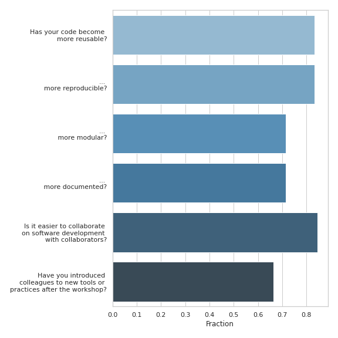
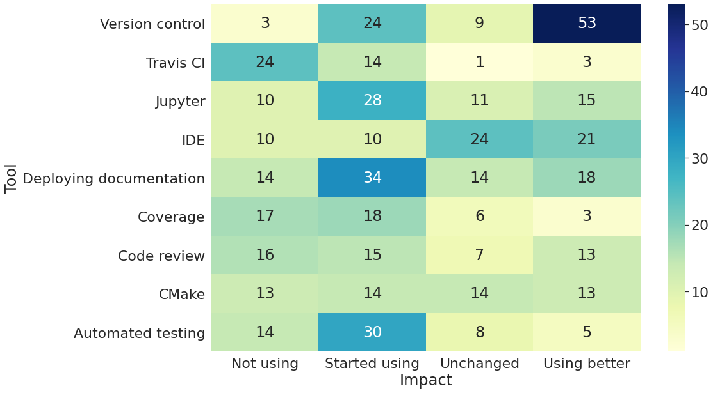

# CodeRefinery post-workshop survey

A survey is sent out to all participants of CodeRefinery workshops
around 3-6 months after the workshop has taken place.

The survey contains the following questions:

- Which workshop did you attend?
- What is your current position?
- How has your usage of the following tools/services changed after attending the workshop?
  (possible answers: 1. I started using this tool; 2. I don't use this tool;
  3. I'm using this tool in the same way as before; 4. I'm using this tool better than before)
  - Version control
  - Automated testing
  - Travis CI
  - Code coverage analysis
  - Jupyter Notebooks
  - CMake
  - Integrated development environments
  - Code review
  - Read the Docs or GitHub/GitLab/BitBucket Pages
- Would you judge your code to have become more reusable/reproducible/modular/documented
  after attending the workshop? (yes/no questions)
  - Reusable
  - Reproducible
  - Modular
  - Documented
- Has it become easier for you to collaborate on software development with your colleagues and collaborators?
- Have you introduced one or more of your colleagues to new tools or practices as a result of the workshop?

## License conditions

This work is licensed under CC 4.0 BY, see the [LICENSE](LICENSE) file.

### Attribution

When using the data from the CodeRefinery post-workshop survey, please state following attribution:
"Post-workshop survey" by [CodeRefinery](https://coderefinery.org), licensed under CC BY 4.0.

## Processing steps

[A script](preprocess-survey-responses.py) is first used to preprocess the raw
data and a [Jupyter Notebook](survey_analysis.ipynb) is used to analyze the
data.

## Results

The main results are reported in these three figures:

#### Impact on code quality and collaboration

#### Impact on usage of software development tools

