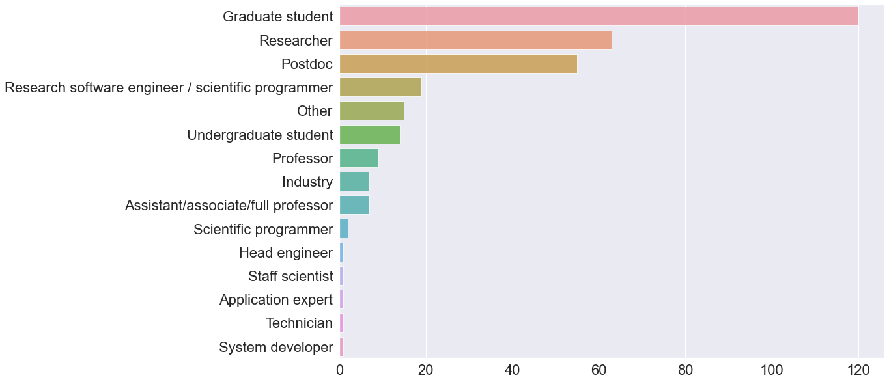
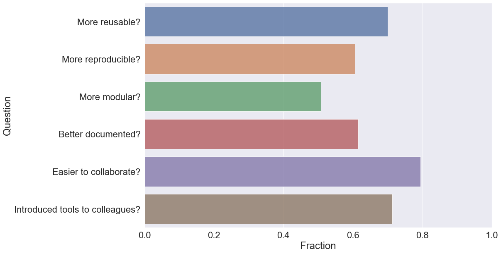
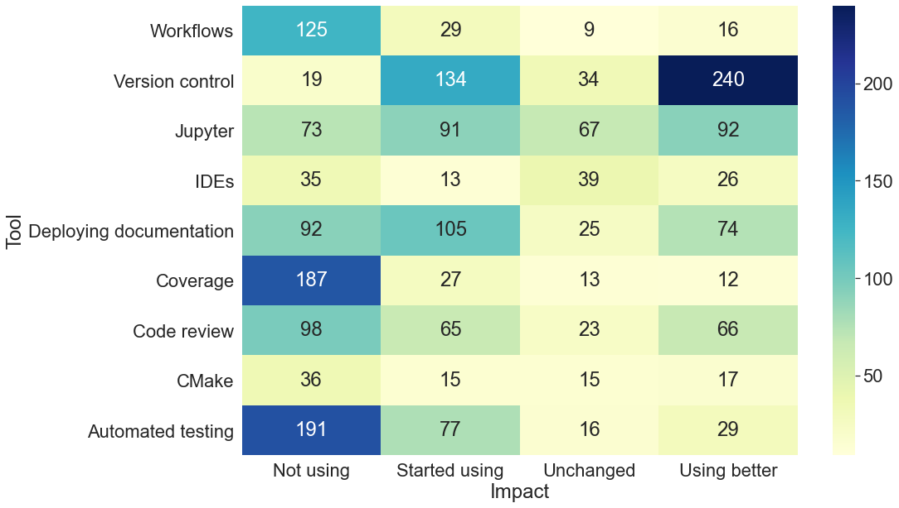

# CodeRefinery post-workshop survey

A survey is sent out to all participants of CodeRefinery workshops
around 3-6 months after the workshop has taken place.

## Survey questions

The survey contains the following questions (they are also recorded in the [questions/survey.json](questions/survey.json) file):

- Background information
  - Which workshop did you attend?
  - Participation style
    - Individual learner
    - Individual helper / exercise leader (online)
    - Team learner (online)
    - Team helper / exercise leader (online)
  - What is your current position?
    - Undergraduate student
    - Graduate student
    - Postdoc
    - Researcher
    - Professor
    - Research software engineer / Scientific programmer
    - Industry
    - Other

- Impact of the workshop
  - Would you judge your code to be better reusable/reproducible/modular/documented as a result of attending the workshop?*
    - More reusable
    - More reproducible
    - More modular
    - Better documented
    - None of the above
  - Which tools/services/workflows have you started using as a result of attending the workshop?
    (Select all that apply. Note that some tools may not have been taught in your workshop.)
    - Version control (e.g. Git)
    - Code review (e.g. via pull requests)
    - Testing (e.g. pytest)
    - Automated testing (e.g Travis CI or GitHub Actions or GitLab CI)
    - Code coverage analysis (e.g. Coveralls)
    - Jupyter Notebooks
    - Documentation hosting platforms (e.g. Read the Docs or GitHub Pages or GitLab Pages)
    - Workflow management tools (e.g. Snakemake)
    - Containers (e.g. Docker or Singularity)
    - Conda environments and virtual environments
    - None of the above
  - Which tools/services/workflows are you using better than before as a result of attending the workshop?
    (Select all that apply. Note that some tools may not have been taught in your workshop.)
    - Same set of possible answers as above
  - Which tools/services/workflows are you using in the same way as you did before attending the workshop?
    (Select all that apply. Note that some tools may not have been taught in your workshop.)
    - Same set of possible answers as above
  - Which tools/services/workflows are you not using?
    (Select all that apply. Note that some tools may not have been taught in your workshop.)
    - Same set of possible answers as above
  - Has it become easier for you to collaborate on software development with your colleagues and collaborators?
    - Yes
    - No
  - Have you introduced one or more of your colleagues to new tools or practices as a result of the workshop?
    - Yes
    - No
  - Would you recommend your colleagues to attend a CodeRefinery workshop?
    - Yes absolutely
    - Probably
    - I don't know
    - Probably not
    - Absolutely not
  - What else has changed in how you write code for your research after attending a CodeRefinery workshop?
    (write as much as you like)
  - Do you have any recommendations on how we should change the CodeRefinery curriculum?
    (write as much as you like)

## License and attribution

This work is licensed under CC 4.0 BY, see the [LICENSE](LICENSE) file.

When using the data from the CodeRefinery post-workshop survey, please state following attribution:
"Post-workshop survey" by [CodeRefinery](https://coderefinery.org), licensed under CC BY 4.0.

## Results

The main results are reported in these three figures:

#### Position

#### Impact on code quality and collaboration

#### Impact on usage of software development tools

